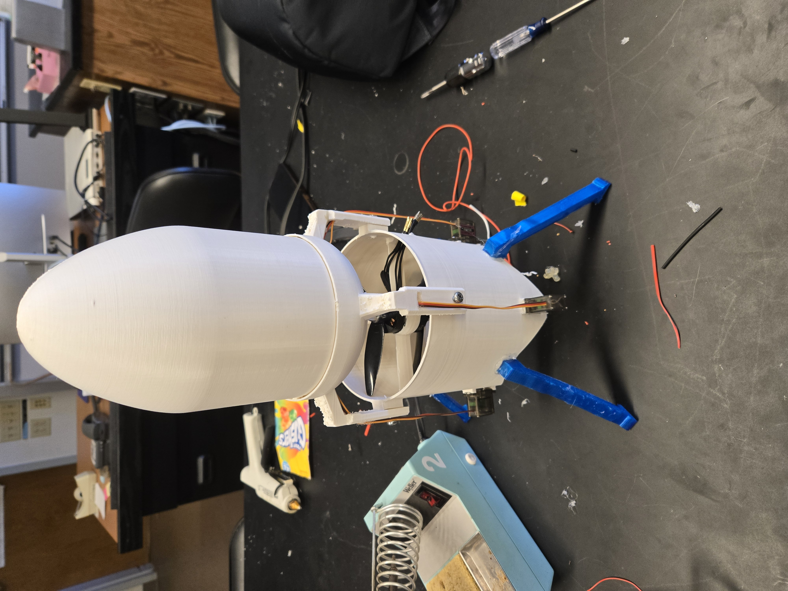

# Monocopter Flight Controller

ESP32-based autonomous flight controller for a single-rotor drone with thrust vectoring control.

## 1) Introduction
### 1.1 What is a monocopter?
- One thrust column, **vectoring vanes** steer the vehicle.

### 1.2 Project goals & aspirations
- **Steady hover:** Achieve stable hover with minimal drift.
- **Controllable movement:** Accurately follow live commands to control position, height, and velocity.
- **Autonomous landing:** Automatically land/return.
- **Robust recovery** After bumps/tilts.

### 1.3 Core challenges
- **Yaw control:** When propellers spin, conservation of angular momentum causes the chassis to spin (yaw).
- **Gyroscopic precession:** External torques cause precession if the chassis has non-zero yaw angular momentum.
- **Coupled aerodynamics**: Vane movement affects both lift and rotation.
- **Balanced weight:** Center of mass is colinear with chassis/propellers.
- **Control system**: Sensor fusion + PID control. Tuning PID values.
- **CAD design + Hardware**: Wire management, heat dissipation, power delivery.

---

## 2) Current Design
### 2.1 Engineering design
- **Airframe**: Ducted, coaxial contra-rotating props for torque cancellation.
- **Actuation**: Four vanes controlled by servos for roll/pitch.
- **Yaw control** Differential propeller speeds compensate for any yaw rotations.
- **Compute/Comms**: ESP32, Wi-Fi/Telnet for live telemetry & tuning.

### 2.2 Hardware at a glance
- **MCU**: ESP32-WROOM-32  
- **Sensors**: IMU (BNO055) for attitude, LiDAR (VL53L0X) for altitude
- **Power**: clean 5 V servo rail, shared grounds.
- 4x servo-controlled fins
- 2x brushless motors with ESCs

### 2.3 Software & control loop
- **200 Hz** cascade PID control loop:
  - IMU-based attitude stabilization
  - Differential propeller speeds control yaw
  - Altitude hold using LiDAR
- WiFi telemetry and tuning interface

### 2.4 Current status
-  Reliable lift, level attitude, altitude hold.

### 2.5 Necessary future improvements
- **Reduced lateral drift:** Use optical flow sensor + gps to remove sideways drift. 

# Flight Videos

<table>
  <tr>
    <td align="center" width="33%">
       
      <b>Trial 1</b> — <i></i>
    </td>
    <td align="center" width="33%">
       
      <b>Trial 2</b> — <i></i>
    </td>
    <td align="center" width="33%">
       
      <b>Trial 3</b> — <i></i>
    </td>
  </tr>
</table>

## CAD DESIGN: Current Version (V4) · 🔗 [Open in Onshape](https://cad.onshape.com/documents/cd4769bf950c45c7067f6297/w/8c559fddb4f0c3af4cccb741/e/18afaee3e5cde682d116e205)

<table>
  <tr>
    <td align="center" width="33%">
       
      <b>Overall Assembly (V4)</b> — ducted coaxial layout.
    </td>
    <td align="center" width="33%">
       
      <b>Thrust-Vectoring Vanes</b> — four-fin control surfaces.
    </td>
    <td align="center" width="33%">
       
      <b>Battery Holder</b> — centered for COM balance.
    </td>
  </tr>
</table>

---

## 3) Project History (What we tried, what failed, what we learned)

### 3.1 V1 — Single EDF + ESP32 (first prototype)
- **What we did**: IMU-only stabilization, single EDF thrust, manual throttle.  
- **What failed**: Torque-induced yaw due to single edf, poor weight distribution, wire management.
- **Lesson**: Ensure center of mass is colinear with chassis/propellers, switch to wireless connection for efficient debugging/tuning.

## V1 (Design & Early Tests)

<!-- Replace PATH_TO_V1_PRINT.png with your actual PNG path, e.g., pictures/V1/print.png -->
<table>
  <tr>
    <td align="center" width="33%">
       
      <b>V1 Print</b> — <i>Early CAD/print layout</i>
    </td>
    <td align="center" width="33%">
       
      <b>V1 Design Video</b> — <i>Walkthrough of V1 concept</i>
    </td>
    <td align="center" width="33%">
       
      <b>V1 Flight Clip</b> — <i>First hover attempts</i>
    </td>
  </tr>
</table>

### 3.2 V2 — EDF + Pi Zero + 3D-printed gimbal (Reinforcement learning attempt)
- **What we did**: Designed and built a gimbal test rig; experimented with **reinforcement learning**.  
- **What failed**: Failed to compensate for both yaw spinning and attitude tilts, Poor training efficiency, RL training did not translate to real world environment, lack of RTOS on Raspberry Pi Zero + Python code.
- **Lesson**: Use two counter rotating propellers to eliminate yaw spin, use a traditional control system approach, better telemetry + debugging tools.

## V2 (Gimbal & String Rigs)
<table>
  <tr>
    <td align="center" width="50%">
       
      <b>V2 Gimbal Rig</b> — <i>Bench tuning on a hinge/gimbal mount.</i>
    </td>
    <td align="center" width="50%">
       
      <b>V2 String Test</b> — <i>Free-hanging stability and recovery checks.</i>
    </td>
  </tr>
</table>

### 3.3 V3 — Coaxial contra-rotating props
- **What we did**: Torque cancellation via coaxial pair, **differential thrust** for yaw, larger chassis diameter.
- **What failed**: Engineering flaws and tolerance issues between parts. Wire management and weight distribution.
- **Lesson**: Larger propeller/chassis diameter, wire management improvements.

## V3 (Photos & CAD)

<table>
  <tr>
    <td align="center" width="33%">
       
      <b>V3 — Monocopter Photo 1</b> — <i>Short caption here (e.g., assembled airframe)</i>
    </td>
    <td align="center" width="33%">
       
      <b>V3 — Monocopter Photo 2</b> — <i>Short caption here (e.g., top view / wiring)</i>
    </td>
    <td align="center" width="33%">
       
      <b>V3 — CAD Image</b> — <i>Short caption here (e.g., fin geometry / duct layout)</i>
    </td>
  </tr>
</table>

## Future Improvements
- Rework entire design to have the center of mass under the point at which thrust is applied for more stability.
- Other ideas include: springs for legs for shock absorbtion, have contra-rotating props on a gimbal for thrust vectoring instead of vanes.

---

## Authors
- Jason Angelov - UCLA Computer Science
- William Crowhurst - UCB Physics
